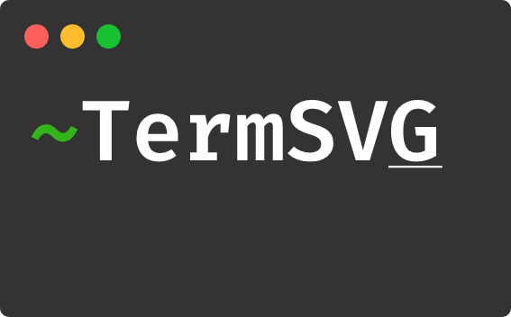

<div align="center">


### Record, share and export your terminal as a animated SVG image.

</div>

<div align="center">
</br>

[](https://github.com/MrMarble/termsvg/actions/workflows/golangci-lint.yml)
[](https://github.com/pre-commit/pre-commit)

[](https://pkg.go.dev/github.com/mrmarble/termsvg)

</div>

---

## Overview

TermSVG is an all in one cli tool to record, replay and export your terminal session to svg. It uses the same format as [asciinema](https://asciinema.org) so you can convert asciicast files to SVG or use the asciinema player with a TermSVG recording.

## Installation

### Manually

You can download a pre compiled binary directly from the [releases](https://github.com/mrmarble/termsvg/releases) for your OS/Architecture.

### Go cli

If you already have Go in your system you can use `go install`

```sh
go install github.com/mrmarble/termsvg/cmd/termsvg@latest # or target a specific version @v0.6.0
```

### Install script

I made an [installation script](scripts/install-termsvg.sh) that should download the latest available version corresponding to your OS and architecture. `sudo` is needed to copy the binary to `/usr/local/bin`

```sh
curl -sL https://raw.githubusercontent.com/MrMarble/termsvg/master/scripts/install-termsvg.sh | sudo -E bash -
# or with wget
wget -O - https://raw.githubusercontent.com/MrMarble/termsvg/master/scripts/install-termsvg.sh | sudo -E bash -
```

---

## Usage

termsvg is composed of multiple commands, similar to `git`, `docker` or
`asciinema`.

When you run `termsvg` with no arguments help message is displayed, listing
all available commands with their options.

### `rec <filename>`

**Record terminal session.**

By running `termsvg rec <filename>` you start a new recording session. The
command (process) that is recorded can be specified with `-c` option (see
below), and defaults to `$SHELL` which is what you want in most cases.

You can temporarily pause recording of terminal by pressing <kbd>Ctrl+P</kbd>.
This is useful when you want to execute some commands during the recording
session that should not be captured (e.g. pasting secrets). Resume by pressing
<kbd>Ctrl+P</kbd> again.

Recording finishes when you exit the shell (hit <kbd>Ctrl+D</kbd> or type
`exit`). If the recorded process is not a shell then recording finishes when
the process exits.

The resulting recording (called [asciicast](doc/asciicast-v2.md)) is saved to a local file. It can later be
replayed with `termsvg play <filename>` and/or exported to svg with `termsvg export -i <filename>`.

Available options:

- `-c, --command=<command>` - Specify command to record, defaults to $SHELL

### `play <filename>`

**Replay recorded asciicast in a terminal.**

This command replays given asciicast (as recorded by `rec` command) directly in
your terminal.

Playing from a local file:

```sh
termsvg play /path/to/asciicast.cast
```

Available options:

- `-i, --idle-time-limit=<sec>` - Limit replayed terminal inactivity to max `<sec>` seconds
- `-s, --speed=<factor>` - Playback speed (can be fractional)

> For the best playback experience it is recommended to run `termsvg play` in
> a terminal of dimensions not smaller than the one used for recording, as
> there's no "transcoding" of control sequences for new terminal size.

### `export <filename>`

**Export recorded asciicast to svg.**

This command exports given asciicast (as recorded by `rec` command) to svg.

Exporting from a local file:

```sh
termsvg export /path/to/asciicast.cast
```

Available options:

- `-o, --output=<file>` - Output svg to be created. Defaults to [input].svg
- `-m, --minify` - Minify svg using [Minify](https://github.com/tdewolff/minify)

## Example

Asciinema recording [inverted pendulum](https://asciinema.org/a/444816)


More at the [examples](examples) folder

## Contributing

If you want to contribute to this project check out [CONTRIBUTING.md](CONTRIBUTING.md).

## License

All code is licensed under the GPL, v3 or later. See [LICENSE](LICENSE) file for details.

## ⭐ Stargazers

## Star History

<a href="https://star-history.com/#mrmarble/termsvg&Date">
  <picture>
    <source media="(prefers-color-scheme: dark)" srcset="https://api.star-history.com/svg?repos=mrmarble/termsvg&type=Date&theme=dark" />
    <source media="(prefers-color-scheme: light)" srcset="https://api.star-history.com/svg?repos=mrmarble/termsvg&type=Date" />
    
  </picture>
</a>
